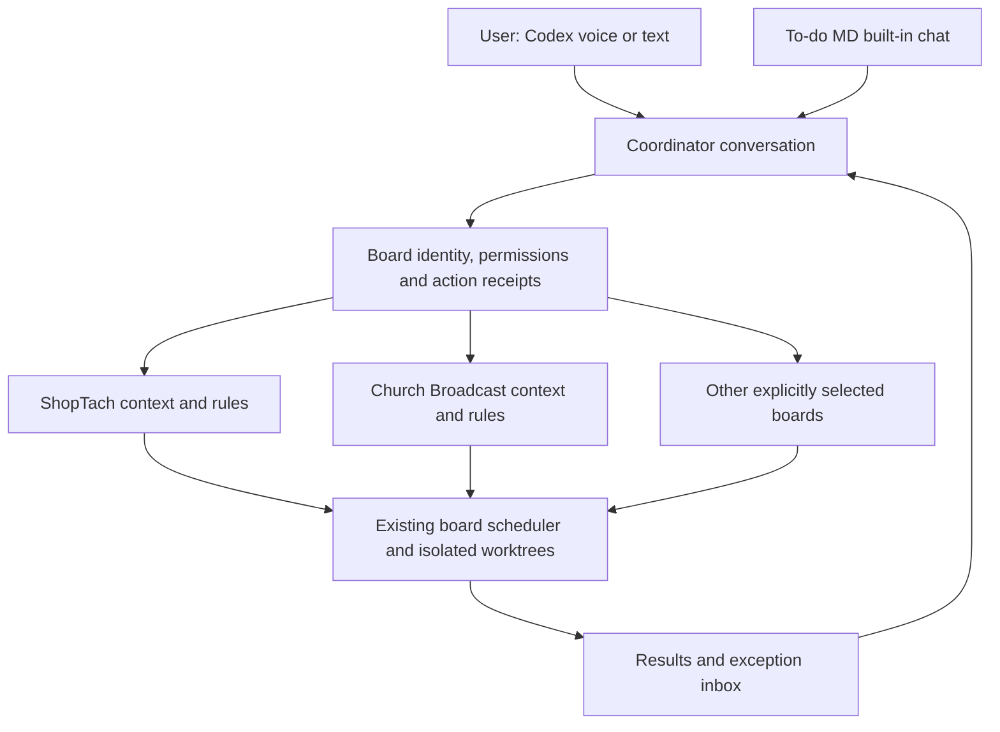

# Separate board context and Codex voice coordination

Status: phases 1–3 implemented and automatically verified, 2026-09-05. Phase 4 (actual spoken acceptance) and phase 5 (production restart/rollout) remain pending. Final regression: 663 core/integration tests and 36 browser tests passed, no skips. Production settings and running service are unchanged. See [current setup](board-agent.md).

## Intended experience

One Codex conversation is the user's point of contact. The user can start voice in that conversation and discuss all explicitly connected boards, focus on one repo, request routine work, and review exceptions. Each board retains its own instructions, decisions, conversation, execution policy, and task history. The coordinator receives brief cross-board summaries and retrieves a board's full context only when needed.

Example: “Give me the status of my boards. Then focus on ShopTach and explain its blocked work. Leave Church Broadcast's queue alone.” Returning to Church Broadcast later restores its own context. “All repos” means the user's selected, initialized boards reachable through the connected server; installing To-do MD in another repo never silently grants access.

A board context is durable data, not an always-running model process. Board work can continue through the existing scheduler while the user talks, without keeping a separate idle model running for every repository.

## Review findings

Reviewed baseline: b5ca6c2. Existing focused tests pass: 14/14 in `test/board-agent.test.js`. Disposable fixtures reproduced the issues below; no application repositories were used for those reproductions.

| Finding | Evidence | Consequence / priority |
| --- | --- | --- |
| One global history, rules object, and busy flag | `src/board-agent.js:57`, `:118`, `:138`, `:262` | Board labels do not provide independent context. One board's priorities and turn can affect all others. Required foundation change. |
| Context allocation favors the first board | `src/board-agent.js:80` shares 40,000 bytes across boards in selection order | Reproduced with 12 detailed cards on the first board and one detailed card on the second: six cards from the first, zero from the second. Per-board summaries and retrieval must replace the combined dump. |
| Unrelated settings changes erase all proposals | `src/board-agent.js:143` | Reproduced: changing only the model deleted a pending card-creation proposal. Invalidate only proposals whose actual authorization or inputs changed; retain terminal decisions for audit. |
| Atomic replacement does not serialize multiple service owners | `src/board-agent.js:65` | Two coordinators using the same directory overwrite each other's history. Reproduced: only the second reply survives. This affects overlapping server instances; concurrent requests to the current single instance share its in-memory state. Add ownership and serialized transactions before expanding controllers. |
| External mode has only context, propose, and reply tools | `src/mcp-server.js:96`, `src/board-agent.js:239` | No per-board retrieval, session binding, or user-message ingress through MCP. Existing exceptions must be approved in the board UI. Codex voice integration is not yet verified. |
| The external credential is the primary desktop token | `src/server.js:184` and `docs/board-agent.md` | Restricted MCP tool names alone are not a server-side capability boundary. The same credential authorizes configuration and approvals through ordinary HTTP. Introduce a dedicated coordinator credential. |
| Repository operating rules are not enforced by an action allowlist | `src/board-agent.js:170` delegates operations; `src/pipeline.js:3447` merges verified builds | “Approve a plan” can eventually reach a merge. A repo such as ShopTach needs an enforceable review-before-merge policy, not just prose instructions. Do not grant autonomous build approval until that policy is supported. |
| Browser voice is a separate, single-board interface | `public/voice/main.js:142` disarms on project change; `src/voice.js:373` implements confirmation tiers | Do not describe the board microphone as the Codex voice connection or assume its confirmation channel is available to an external MCP agent. |

The existing strengths remain useful: selected name/path binding, parse and dependency diagnostics, explicit routine permissions, durable request receipts, exception proposals, and existing pipeline locks and scheduler controls. Preserve these as the execution foundation.

## What Codex voice supports, and what still needs validation

Official documentation establishes that users can open a Codex task and start voice to discuss or steer its work. Availability depends on the app, rollout, account, and workspace. Existing-task voice may require updating the app and its host. See [ChatGPT Voice](https://learn.chatgpt.com/docs/features/voice).

Codex supports local STDIO MCP servers and desktop configuration under Settings → MCP servers; its clients share MCP configuration. See [MCP configuration](https://learn.chatgpt.com/docs/extend/mcp?surface=cli). Installed plugins can supply MCP tools to new chats; see [Plugins](https://learn.chatgpt.com/docs/plugins).

Together these support the proposed route: voice in a Codex coordinator task → the task's To-do MD MCP tools → the board coordinator → repo-specific pipeline work. This is an architectural inference from supported capabilities, not a claim that our plugin has passed an actual spoken end-to-end test.

Current local observations: no To-do MD tools are exposed in this review task, and no matching standalone To-do MD server entry was found in the inspected user MCP configuration. The available To-do MD plugin skill describes a viewer-only connection. That viewer role must remain read-only. A separate Board Agent connection is needed for delegated routine operations. This inspection does not prove what every other existing Codex task has loaded.

Use the native Codex voice feature for the first release. No separate OpenAI Realtime implementation is needed for this path. The initial flow is to open the configured Codex task and start voice there. A one-click “Open in Codex” affordance is optional and must use a supported, verified navigation mechanism; automatic voice startup from a To-do MD webpage is not assumed.

## Data and context architecture

1. **Stable board identity.** Assign a server ID and board UUID, bound to a canonical registered repository path. Names and user-defined spoken aliases are display/routing aids. IDs survive renaming. Path replacement requires an explicit rebind. Do not infer shared identity from a Git remote: distinct worktrees may intentionally be different boards.
2. **Separate board records.** Store board instructions, structured policy, context revision, trusted repository-rule references, history, a sourced decision summary, pending proposals, receipts, and last observed board state. Live cards and run state remain authoritative; summaries carry timestamps and source event IDs.
3. **Separate coordinator record.** Store selected boards, global user preferences, cross-board requests and decisions, and compact board summaries. Do not copy the entire global conversation into every board. A cross-board request may reference multiple board IDs, but only its relevant portion reaches each board context.
4. **Explicit conversation scope.** Every message and request carries a session ID plus `scope: portfolio` or a board ID. Board-specific chats load only that board's detailed history. The coordinator can intentionally retrieve several authorized contexts for a comparison. This is separation within one user's workspace, not a promise that the coordinator can never read both.
5. **Focused retrieval.** Always return a compact status row for each selected board, then page cards and fetch named card details on demand. Budget detailed context fairly across requested boards. Return cursors, revision IDs, and explicit omission counts; never interpret a truncated list as an empty board.
6. **Repository rules.** Load approved repository guidance with its path and revision. Keep user preferences, trusted operating rules, and untrusted card text distinguishable. Convert important restrictions into structured enforcement: isolated checkout requirements, allowed base branches, review-required publishing, and no automatic merge/deploy.

For the first version, retain filesystem storage but introduce a versioned state store with one fenced service owner per state directory and serialized, revision-checked transactions. Hold locks only while reading/committing state, never while awaiting a model. Store per-board files and coordinator metadata behind that interface. Persist dispatch intent before execution and outcome afterward. Uncertain interrupted operations require reconciliation, never blind replay. Keep request identity namespaced by server, client/session, board, and request ID.

## Rules, workers, and approvals

Each board gets its own action permissions, instructions, watching setting, execution/publishing policy, and stop control. Global limits constrain total work; board settings may narrow them. Display the effective policy before saving. Written instructions remain guidance rather than hidden executable rules.

Reuse existing pipeline workers for code changes. The coordinator does not directly edit whichever repo happens to be the Codex task's current directory. Every action resolves an explicit board ID and, where applicable, a card ID. Execution revalidates current policy, board identity, card revision, dependencies, pause state, and live runs under the relevant lock.

Implement review-required publishing before enabling autonomous builds for repos that prohibit direct main commits/merges. Verify board metadata commits also respect that policy. The current ShopTach installation is local and uncommitted; turning on automated execution is a separate readiness step, not a side effect of connecting voice.

A client lease determines who may initiate autonomous turns for a board: built-in or external. Multiple interfaces may read and send messages without running competing controllers. A per-board turn lock allows activity on other boards; the existing machine-wide resource governor still limits pipeline execution.

Routine actions execute within saved rules. Exceptions produce a concrete read-back naming the board, card, action, and expected effects. In the first voice release, exceptional actions use the existing visible approval UI. Do not add an MCP tool that accepts an agent-supplied `approved: true` as human consent. Spoken approval can come later only if a verified host-mediated consent mechanism binds it to a fresh proposal and cannot be fabricated by the agent.

“Stop listening,” “stop the coordinator for ShopTach,” “pause ShopTach's queue,” and “cancel that build” are different operations. Explain and enforce the requested one. Ending voice does not cancel already-dispatched board work. Background coordinator activity after disconnect requires the user's explicit watching policy and an active authorized controller.

## Codex connection and voice routing

Ship a separately enabled Board Agent MCP connection/plugin, preserving the existing viewer-only plugin. Use a revocable token limited to selected board reads, message ingress, and policy-checked action submission. Deny raw card mutations, configuration edits, approvals, unrelated boards, and general file access at the HTTP boundary as well as in tool discovery. Document that any separately granted shell or unrestricted connector access remains an independent capability.

Proposed tools:

| Tool | Contract |
| --- | --- |
| `board_agent_overview` | Every authorized board's status, effective policy, and connection health; paginated when needed. |
| `board_agent_context` | Require a board ID for detailed memory, cards, or selected card details; cursor and revision aware. |
| `board_agent_message` | Persist a request with session, source, scope, and idempotency key. User text grants no capability beyond saved policy. |
| `board_agent_propose` | Typed action enum and explicit board ID; return executed, pending, blocked, rejected, or uncertain plus reason. |
| `board_agent_reply` | Save a scoped response referencing actual action receipts and sources. |
| `board_agent_events` | Cursor-based recent results and pending exceptions, supporting reconnect without repeating actions. |

Voice routing rules:

- An explicit board name or configured alias establishes focus and is spoken back briefly.
- “This board” resolves only from the session's explicit focus; browser-tab changes cannot silently change it.
- Shared card titles and identical `task-0001` IDs require a board-qualified match.
- Ambiguous or conflicting speech prompts a short clarification before mutation.
- “All boards” expands only to the authorized selection. Preview the target set for a bulk change; execute separate checked actions and report partial outcomes honestly.
- A new/reconnected session retrieves saved board context and fresh state. It does not rely on a giant old Codex transcript as the database.

One user-opened Codex coordinator task can cover the selected repos through these tools. Repo work remains isolated. Creating a separate user-owned Codex task for a repo is optional and explicit, not something required for each status question.

## Implementation sequence and acceptance gates

| Phase | Deliverable | Required proof |
| --- | --- | --- |
| 1. Reliability and identity | Versioned store, stable board IDs, service ownership, fair retrieval, targeted proposal invalidation | No lost updates with competing owners; large boards cannot hide small boards; stale identity/policy cannot authorize writes. |
| 2. Board context and rules | Per-board memory, scoped chat, sourced summaries, structured execution policy, per-board stop/ownership | ShopTach decisions do not enter Church Broadcast's context; different permissions are enforced; review-required repos never merge or commit to main through an automatic path. |
| 3. Codex connection | Dedicated scoped credential, typed MCP tools, session ingress and event cursors, setup/health screen | Viewer connection remains read-only; agent credential cannot configure or approve through raw HTTP; external and built-in paths apply identical board policies. |
| 4. Voice acceptance | One configured Codex task, spoken focus changes and multi-board requests, visible exception approval | Actual spoken tests below pass; clear fallback when voice/tools are unavailable. |
| 5. Controlled rollout | Migrate current ShopTach/Church Broadcast setup, then opt in other boards | Current permissions, queue state, and watching settings survive; no new repo is implicitly selected or started. |

Migration: back up v1 state; bind existing selected name/path pairs to IDs; preserve current global permissions as explicit initial policies for those existing boards, with a visible migration summary. New boards start with no routine permissions. Route attributable action events by board. Keep unattributable legacy conversation in a coordinator archive rather than inventing per-board history. Preserve receipts and uncertain outcomes; mark affected old proposals as requiring refresh without erasing their audit history. Persist v2 completion before switching readers; retain a rollback copy and refuse incompatible concurrent writers.

## End-to-end acceptance scenarios

Use disposable repos first, then the selected real boards in read/propose-only mode:

1. Start voice in the configured Codex task and ask for all boards; every selected board is represented, including a small board after a large one.
2. Discuss ShopTach, switch to Church Broadcast, then return; each retains the correct decisions and instructions.
3. Ask to act on “task one” where both boards have `task-0001`; no mutation occurs until the board is resolved.
4. Permit creating cards on one board and require approval on the other; the same spoken request produces the correct distinct outcomes.
5. Speak a task title containing `: `; created frontmatter parses and the card belongs to the intended repo.
6. Ask why Queue work did not start; the reply uses actual parse, dependency, pause, or admission diagnostics.
7. Change a card, policy, or registered path after a proposal; approval is rejected as stale. Changing only another board's model does not erase this proposal.
8. Disconnect or restart during a dispatch; reconnect returns the existing receipt or an uncertain outcome, never a duplicate action.
9. Stop only one board coordinator; other boards remain available, and already-running work is accurately reported.
10. Reject scope expansion and policy changes attempted through card text or the external credential. Test raw HTTP denial, not just absence from MCP tool listings.
11. Check a repo with review-required publishing: verified work stops at the review boundary without a main commit, automatic merge, or deployment.
12. Close voice: demonstrate what continues, what stops, and how a later voice session resumes the saved board context.

The existing focused suite is a baseline, not evidence for these future behaviors. Add targeted store, policy, context, transport, and browser tests as each phase lands. Use one final full To-do MD regression run for the implementation. No ShopTach application build or full test suite is necessary for this planning document.

## Recommendation

Proceed with one coordinator conversation and separate durable contexts/policies per board. Make native Codex voice the external contact interface, using the policy-enforcing MCP connection. Complete phases 1–3 before presenting the experience as ready to run all repos, and require the real voice acceptance test before claiming voice operation is verified. Multi-host federation and approvals based solely on speech remain outside the first release.

## Implementation choices

The v2 store uses one atomic snapshot containing separate board records instead of multiple board files. This makes policy/history/receipt transactions atomic without a partial multi-file commit. One fenced owner holds the service directory; model calls never hold a repository lock. Three independent board turns may run concurrently; a portfolio turn takes exclusive coordinator scope, and existing pipeline resource limits still apply.

External tools page card details and expose recent separate board memory. Built-in portfolio turns use equal small detail allocations plus every board summary; the user focuses a board when additional detail is needed. Arbitrary older conversation search and automatic multi-pass model retrieval are not included. The sourced decision summary is a bounded set of recorded decision events, not model-generated long-term memory.

The structured publication policy enforces review-before-merge and protected-branch metadata commits through To-do MD. Other repository prose remains revisioned guidance. The existing pipeline provides worktree isolation; this change does not add an arbitrary policy language or deployment control over separately granted shell tools. External session leases last 60 seconds; the client must initiate work and no external background scheduler is installed.

The native Codex voice connection is prepared through a separate scoped STDIO MCP entry. No entry was activated against the still-running v1 service. Production restart, Codex connection loading and actual spoken acceptance remain explicit rollout gates.
