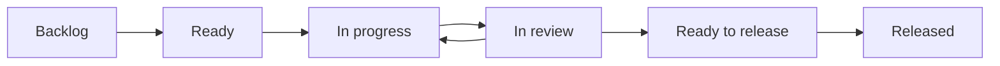

# To-do MD delivery workflow update plan

Status: approved for incremental implementation; read-only foundation implemented  
Date: September 8, 2026  
Baseline: `ce1d1a0` (includes runtime recovery corrections in PR #17)  
Pilot project: To-do MD itself

The first increment implements the [delivery schema, assessment rules, and
read-only migration preview](delivery-foundation.md). The next implements an
internal [durable ownership, lease, and transition store](delivery-ownership.md).
The [runtime compatibility guard](delivery-runtime.md) now makes the legacy
scheduler, recovery controls, and card writes respect that private ownership.
Existing boards still use the legacy runtime. Coordinated runtime admission and
recovery adapters, cycles, the new board view, evidence adapters, migration, and
pilot activation remain future work. Phase 3 is not complete until its runtime
integration and recovery acceptance gates pass.

## 1. Objective

Evolve To-do MD into a delivery system in which humans set product direction,
agents own bounded responsibilities, and every change can be followed from an
agreed outcome through implementation, review, integration, and release.

The main board should answer:

- What outcome are we pursuing, and why is this work next?
- Who owns delivery, who is executing it, and who reviews the result?
- What is preventing progress, and who takes the next action?
- What has been reviewed, merged, deployed, and verified in the target environment?

Retain the Markdown task files, isolated worktrees, scheduler, trusted CI,
independent verification, preserved recovery, and per-project publication rules.
Build a delivery model around these capabilities through incremental changes.

Success means fewer ownerless or stranded tasks, less repeated human intervention,
and a trustworthy account of delivered outcomes. Agent activity and card movement
alone do not establish success.

## 2. Proposed operating model

Use a prioritized backlog and a weekly planning cycle with one clear goal.
Agents pull eligible work continuously within explicit capacity limits. A cycle
does not require waiting until its end to release completed work.

| Entity | Responsibility |
| --- | --- |
| Project | Product/repository identity, accountable human, delivery lead, completion policy, and release rules. |
| Epic | A measurable outcome, an owner, child tasks, and acceptance of the combined result. |
| Cycle | A goal, ordered task selection, start/end dates, capacity policy, and a record of scope changes. |
| Task | A bounded change with criteria, dependencies, ownership, implementation evidence, and a completion requirement. |
| Assignment | A durable responsibility held by a human or an agent role. |
| Run | A particular execution attempt, with provider/session/host identity and temporary exclusive authority. |
| Release | A set of integrated changes, target environment, deployment evidence, verification, and rollback outcome. |

A task may exist outside an epic or cycle. Urgent operational work uses an explicit
expedite lane, with the interruption and any displaced work recorded. Cycle
selection and assignment never grant additional execution or publication rights.

Initially omit story-point estimation, mandatory agent meetings, automatic
cross-project reprioritization, and a general-purpose organization chart. Use
observed delivery data before introducing additional planning mechanics.

## 3. Separate delivery state from execution state

### Delivery board



| Delivery state | Entry evidence |
| --- | --- |
| Backlog | Request captured; refinement or prioritization may still be required. |
| Ready | Scope and criteria are actionable; dependencies are valid; an owner and validation plan exist; required planning approval is recorded. |
| In progress | An authorized implementation assignment has been admitted. |
| In review | A candidate is ready for CI/independent review, or its PR awaits review/publication approval. |
| Ready to release | Required checks and reviews passed and the relevant change is integrated into the intended target. |
| Released | The release record proves deployment and the required environment verification succeeded. |

Tasks that require no deployment, such as a documentation investigation, use a
declared completion policy and a terminal **Completed** state. Such tasks must
not appear as Released. A software task requiring deployment remains unfinished
at Ready to release.

Cancellation is a separate terminal outcome with a recorded reason. Reopening,
scope withdrawal, and backward moves require explicit transition rules and keep
the previous evidence in history.

### Execution detail

Retain runtime stages such as Plan, Queued, Build, CI, Verify, and recovery within
the task drawer and operational views. A run also has a result such as running,
passed, failed, cancelled, interrupted, or awaiting admission. Delivery state
must not be inferred from a process exit code alone.

Blocked work retains its delivery state and displays a blocker containing:

- Category: dependency, environment, provider, implementation, review, publication,
  or product decision.
- Evidence and the time blocking began.
- The responsible owner and the next permitted action.
- Whether agent recovery is authorized, with its attempt/cost limits.

For example, a candidate waiting for publication review remains **In review**
with its release owner identified. A failed CI environment remains associated
with the candidate and names the environment owner. A product question names
the human decision-maker. Each case has a distinct recovery route.

The server computes action availability and validates it again on execution.
The UI, APIs, voice interface, and Board Agent use that same transition service.
Preserve the admission guards, candidate preservation, and exact-source checks
introduced by the existing runtime hardening.

## 4. Ownership and agent assignments

| Role | Accountable for | Boundary |
| --- | --- | --- |
| Human product owner | Priorities, product decisions, acceptance policy, and delegated authority. | An agent may recommend decisions but cannot invent approval. |
| Project delivery lead | Refining tasks, sequencing dependencies, assigning work, following blockers, and reporting outcomes. | Acts only through granted board operations. |
| Implementation owner | Producing the change and responding to findings through integration. | One active implementation writer per task. |
| Independent reviewer | Evaluating the candidate against criteria and required evidence. | Cannot approve its own implementation run or silently modify the candidate. |
| Release owner | Integrating approved work, deploying when authorized, and recording verification/rollback. | Project publication and environment gates remain authoritative. |

Assignments use stable identities, such as `agent-role:todomd-maintainer`, with
human-readable names. Provider, model, machine, and session are attributes of a
run. Replacing a failed runner does not remove task ownership or create a new
product task.

Execution ownership uses a persisted lease with an owner, generation, heartbeat,
and expiry. A replacement writer must reconcile and fence out the prior writer;
lease expiry by itself is insufficient evidence that the previous process stopped.
This complements the existing process-stop barriers and local repository lock.

A handoff carries the task revision, candidate commit/worktree, accepted decisions,
findings, remaining work, validation evidence, and next action. Do not require a
provider conversation to survive for work to be recoverable.

For the first pilot, one lead role may cover coordination and release preparation,
while implementation and independent review remain distinct. One integration
operation per target branch is admitted at a time. Role assignment never bypasses
human approval requirements.

## 5. Planning, dependencies, and capacity

### Definition of Ready

A task can enter Ready when it has an outcome, testable criteria, bounded scope,
an implementation owner, a reviewer route, a validation plan, and a known target
branch. Its dependency references must resolve without cycles. Dependencies may
still be pending, but admission must explain and enforce the wait.

Dependencies distinguish **integrated** from **released** requirements. An API
consumer may depend on an integrated code change; a production migration consumer
may require a successful deployment. Preserve existing dependency behavior during
migration until each dependency is explicitly converted.

An epic becomes accepted only when its required children meet their completion
policies and epic-level integration criteria pass. Cancelled children do not count
as successful completion; removing them from scope requires an audited decision.

### Pilot capacity

Start with one implementation writer per repository and a maximum of two started,
unfinished implementation tasks. Blocked and review-waiting work count toward the
limit. Operational Build/CI limits remain separate scheduler controls.

Prioritize finishing and unblocking existing work. If a prerequisite must start
to resolve a full WIP limit, the lead proposes an explicit temporary exception or
withdraws another task from active scope; never silently bypass the limit. Reassess
capacity after the pilot using review delay, CI throughput, and overlap conflicts.

At cycle close, inspect completed outcomes, blockers, rework, and interventions.
Unfinished work is explicitly carried forward, returned to the backlog, or
cancelled. Preserve the original cycle membership and reason for the change.

## 6. Pull requests, integration, and releases

Default to one reviewable task change per PR. Keep links to superseded PRs and
allow an explicitly declared task/PR relationship when a change needs several
PRs. A release may contain many tasks and PRs.

Bind CI, review, and merge evidence to immutable commits and the relevant policy
revision. New candidate commits invalidate approvals according to repository
policy. Resolve conflicts in the preserved candidate and rerun affected checks.

GitHub supplies authoritative PR, merge, check, and deployment facts where those
services are used. To-do MD owns task intent, assignment, cycle membership, and
delivery policy. Store reconciled external evidence with source identifiers and
timestamps; do not create two independently editable completion records.

Support normal merge strategies deliberately. The current recovery path confirms
publication through ancestry and cannot infer squash/cherry-pick equivalence.
The new release integration must either correlate the reviewed PR and its recorded
merge result, or report that completion cannot yet be established. It must never
guess from a matching title, a closed PR, or similar-looking files.

A release record includes target environment, tasks, PRs, deployed commit or
artifact identity, required approval, deployment result, verification evidence,
and rollback information. Failed deployment or verification leaves tasks pending
release. A later rollback records the affected release and its current availability
without erasing the historical successful deployment.

## 7. Data and API design

The following names are proposed contracts to finalize in Phase 1.

| Data | Proposed location/authority |
| --- | --- |
| Task intent, criteria, dependencies, ownership references | Existing `.todomd/tasks/*.md`, with additive versioned fields. |
| Cycles and non-sensitive role definitions | Versioned `.todomd/cycles/` and project configuration. |
| Release intent and safe evidence references | Versioned release records; sensitive deployment output stays in the appropriate private store. |
| Execution leases, private run receipts, credentials | Server-owned private runtime storage; never embedded in task files. |
| PR/check/deployment facts | External service records with reconciled local references. |

Example task additions:

```yaml
schema_version: 2
delivery:
  state: in_review
  completion_policy: released
  target_environment: production
  cycle_id: cycle-0001
ownership:
  delivery_lead: agent-role:todomd-lead
  implementation: agent-role:todomd-maintainer
  reviewer: agent-role:todomd-reviewer
  release: human:project-owner
```

Continue using existing `parent`/`children` links for epics. Treat `assignee` as a
compatibility display field until explicitly mapped to a stable owner. Unknown
names remain unresolved; migration must not invent identities or permissions.

Add typed operations for assignment/handoff, cycle scope, delivery transitions,
blocker resolution, PR reconciliation, and release recording. Mutations require
an expected revision and an idempotency key. Responses include the new revision,
accepted action or rejection reason, and current allowed actions.

During migration, legacy `status` remains the runtime compatibility field. The
delivery transition service owns the new state and consumes verified runtime
events. Publish a versioned adapter so old clients cannot silently reinterpret
delivery states or drive new transitions by writing legacy columns.

Hand-edited files are validated as proposed intent. Claims of approval, merge,
deployment, or completion require authoritative evidence before admission or
state advancement. Malformed or contradictory records remain visible with a
repair explanation.

Likely implementation boundaries:

- `src/board.js`: schemas, dependency milestones, persistence, and compatibility.
- New delivery/assignment/cycle/release modules: transition rules and domain logic.
- `src/pipeline.js`, `src/runstore.js`, `src/scheduler.js`, `src/coordination.js`:
  execution events, ownership leases, recovery, and capacity enforcement.
- `src/chunks.js`: epic decomposition and completion rollups.
- `src/server.js`, `src/board-agent.js`, MCP and voice adapters: typed operations,
  evidence reconciliation, permissions, and consistent action availability.
- `public/app.js` and `public/index.html`: delivery board, operational detail,
  owners, blockers, cycles, PRs, and releases.

Tracked board data remains repository content. Additive fields must not copy
private conversations, credentials, or sensitive run output into Git history.

## 8. Implementation phases and acceptance gates

| Phase | Deliverable | Acceptance gate |
| --- | --- | --- |
| 1 — Contracts | State/event model, role identities, completion policies, dependency milestones, and migration specification. | Every state has valid next actions, an owner for exceptions, and explicit evidence requirements. Review example traces for success, failure, interruption, and rollback before implementation. |
| 2 — Compatibility foundation | Versioned schema, transition service, read-only delivery projection, and migration preview. | Existing boards behave unchanged with the feature off. Preview reports ambiguous states and produces no writes or agent runs. |
| 3 — Ownership and recovery | Stable assignments, persisted/fenced admission, durable handoffs, and owner-specific blockers. | Concurrent requests admit one writer; restart/reassignment preserves candidate and history; an expired lease cannot enable overlapping writers. |
| 4 — Delivery board and cycles | Delivery view, operational detail, owner filters, weekly goal/scope, WIP controls, and epic rollups. | Drawer, board, API, and agent agree on state/actions. Cycle changes neither enqueue work nor reset attempts. Blocked work remains visible and counts toward WIP. |
| 5 — PR and release evidence | PR/check reconciliation, integration tracking, environment-specific release records, and completion gates. | A merged PR cannot imply deployment. Required review cannot be bypassed. Squash merges, stale events, failed deploys, and rollbacks reconcile correctly or fail visibly. |
| 6 — To-do MD pilot | Opt-in use on one project for two weekly cycles, followed by a rollout decision. | Pilot criteria below pass and observed interventions/blocker age are compared with the baseline. Expand one project at a time. |

Build each phase as small tasks and reviewable PRs. Keep the feature off by default
until the end-to-end pilot path is available. Work estimates should follow Phase 1
decomposition; this plan does not promise delivery dates before that review.

## 9. Migration and rollback

1. Capture a baseline of current board behavior, task revisions, candidates,
   running jobs, and publication rules. Preserve the current server's private
   state separately from tracked task files.
2. Introduce tolerant readers and an explicit schema version. Generate a dry-run
   migration report before enabling writes for a project.
3. Map legacy Review/Plan/Planned into refinement/Ready according to actual plan
   approval evidence. Map Queue/Build into active delivery only where prior
   admission or approval supports it. Map CI/Verify to In review.
4. Interpret Needs Human using its reason, last trustworthy stage, and evidence.
   Preserve uncertain cases for review with their candidate intact.
5. Treat legacy Done as historical integration/completion evidence under its old
   contract. Deployment is **unknown** until confirmed. Never bulk-label old
   cards Released. Preserve previously satisfied legacy dependencies until they
   are deliberately converted to new milestone semantics.
6. Enable the pilot at a controlled boundary. Reconcile running and accepted
   remote jobs; do not duplicate submissions, rebuild candidates, or reset
   attempts as a migration side effect.
7. Validate counts, links, assignments, approvals, candidate identity, and
   dependency behavior. Keep an audit of mappings and explicit human decisions.

Rollback initially means disabling the new delivery UI and using the compatible
runtime. It must preserve newly recorded evidence. After new-schema writes begin,
do not start an incompatible older server against them. If state restoration is
necessary, retain post-migration events and reconcile external jobs/releases
before restoring a snapshot; never replay accepted actions blindly.

## 10. Verification and pilot measures

Required automated coverage includes:

- Transition-table tests for every state, blocker category, and authorized role.
- Concurrent assignment, reset, recovery, cancellation, and reassignment races.
- Restart during handoff, expired lease with a surviving writer, and uncertain
  remote acknowledgements.
- Missing/cyclic dependencies and integrated-versus-released dependency gates.
- Candidate changes after CI/review, target-branch changes, external merge
  strategies, duplicated/out-of-order events, and revoked permissions.
- Historical Done cards without deployment evidence and migration/rollback with
  preserved worktrees, attempts, journals, and accepted external jobs.
- Browser flows from backlog through release, including owner handoff and a
  blocked task's visible next action; read-only clients remain read-only.

Continue the repository's local CI, packaged-install checks, and supported Linux
Node matrix. Use disposable boards and fake agents for destructive/recovery
fixtures. Real-provider and deployment checks use the authorized pilot workflow.

Record cycle time, blocker age, review wait, started-but-unfinished work, rework,
human interventions, and verified releases. Record sample sizes; two cycles can
expose design failures but cannot establish a reliable long-term velocity.

Pilot exit criteria:

- Every active task has a stable owner; every blocker has a responsible party
  and an available next action or a specific human decision request.
- A runner can fail and be replaced without losing the task, candidate, findings,
  or execution history, and without concurrent writers.
- At least one task completes through PR review, integration, deployment, and
  environment verification with linked evidence.
- At least one interrupted task recovers through the supported UI/API path
  without manual frontmatter repair or resetting its candidate.
- No card is reported Released from merge evidence alone.
- Publication rules, board boundaries, and human approval requirements remain
  enforced across UI, agent, and external integrations.

## 11. First implementation epic

**Epic: Make agent delivery understandable and accountable.**

Outcome: for every active To-do MD task, the board can identify its delivery
stage, owner, current executor, blocker/next action, and evidence of completion.

Initial task sequence:

1. Specify delivery states, events, evidence, and compatibility mappings.
2. Implement validated additive schema and a read-only migration preview.
3. Introduce stable ownership and durable handoff records.
4. Unify state/action presentation around the transition service.
5. Add the delivery board with operational detail and blocker ownership.
6. Add cycle goals, scope history, and explicit WIP controls.
7. Link PR integration and release evidence; implement completion policies.
8. Exercise migration, interruption, recovery, and release in the To-do MD pilot.

Phase 1 should turn these items into scoped implementation cards with named
owners and dependencies. This document does not enqueue work or change live
board policy.

## References

- [Current To-do MD workflow](../README.md)
- [Existing coordination and assignees](coordination.md)
- [Board Agent permissions and publication policy](board-agent.md)
- [Runtime recovery corrections](runtime-recovery-followups.md)
- [GitHub Flow](https://docs.github.com/en/get-started/using-github/github-flow):
  branch-based development, pull requests, checks, and integration.
- [Scrum Guide](https://scrumguides.org/scrum-guide.html): product/cycle goals and
  shared completion criteria informing the proposed planning cadence.
- [The Kanban Guide](https://kanbanguides.org/the-kanban-guide/): explicit workflow,
  WIP control, and flow measures informing continuous execution.
