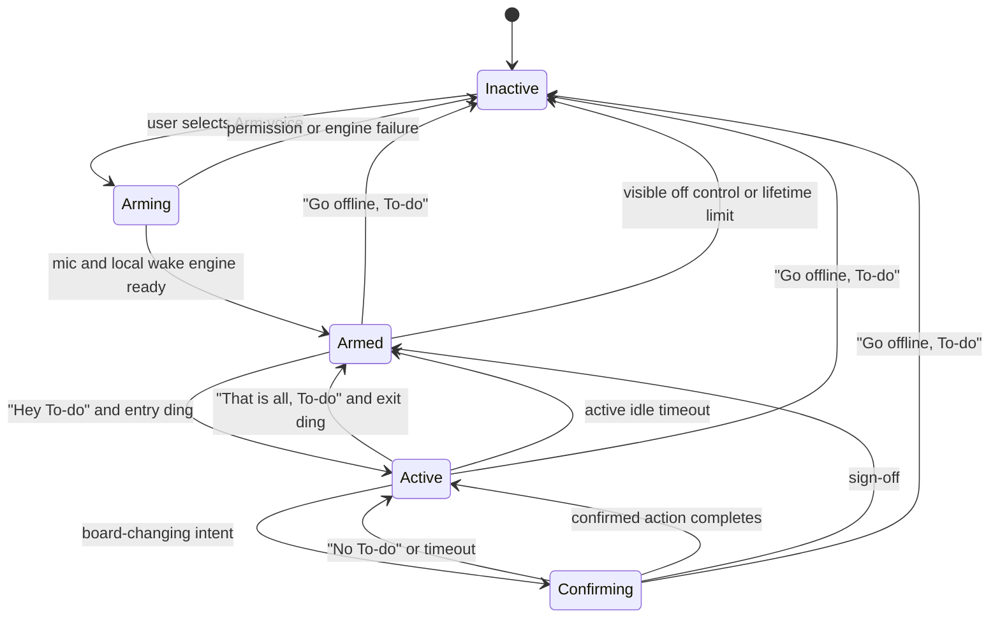

# Hands-free voice control plan

Status: architecture selected; desktop wake capability spike required before build
Date: 2026-08-01
Scope: TODOMD desktop board, foreground mobile board, Codex Remote, and optional Slack companion

## Decision

Build a dedicated TODOMD voice controller as the primary hands-free interface.
On macOS it will first use Chrome's built-in, on-device Web Speech API to detect
**Hey To-do**, with local processing required and cloud fallback prohibited.
It will use **OpenAI Realtime API over WebRTC** only after wake for recognition,
conversation, and speech. It will play an audible acknowledgement, accept
constrained board commands, speak reports and confirmations, and return to
local wake-listening after a spoken sign-off.

The first release will not automate the user interfaces of Codex, ChatGPT,
Claude, Gemini, Siri, Slack, or another voice product. Those products do not
expose reliable controls for programmatically opening and closing their live
voice sessions. UI automation would require broad Accessibility permission and
would depend on focus, timing, and labels outside TODOMD's control.

The selected product has four layers:

1. A replaceable local wake engine. The first implementation is Chrome's
   on-device `SpeechRecognition` with `processLocally: true`; no pre-wake audio
   leaves the device. Porcupine is a fallback only if the capability spike does
   not meet the reliability gate.
2. A short-lived OpenAI Realtime session created only after wake. WebRTC is the
   client transport, and `gpt-realtime-2.1-mini` is the initial default model.
   `gpt-realtime-2.1` is a configurable quality upgrade, not a separate design.
3. The existing TODOMD API and pipeline as the only authority for card changes.
4. Optional Codex/MCP and Slack surfaces for remote work, notifications, and
   approvals; neither is the wake layer.

The Realtime model may understand language and propose typed actions, but it is
never authorized to execute or confirm them. TODOMD owns the proposal,
read-back, confirmation, revalidation, and pipeline dispatch. OpenAI API usage
is separately metered and is not supplied by a ChatGPT or Codex subscription.

## Product contract

After one deliberate **Arm voice** action and browser microphone permission, the
normal loop is hands-free:

1. The board listens locally for **Hey To-do**.
2. Ordinary conversation is discarded locally.
3. On wake, the board plays a rising two-tone earcon.
4. The user asks for a report or gives a command.
5. Read-only commands run immediately.
6. A board-changing command is prepared by TODOMD and read back. A reversible
   workflow change waits for **Yes To-do**; an action that starts or resumes an
   agent waits for the task-specific challenge spoken by the board.
7. **No To-do**, any unrelated response, or a confirmation timeout cancels it.
8. **That is all, To-do** plays a falling earcon, ends the active conversation,
   closes any voice-provider connection, clears pending state, and returns to
   local wake-listening.
9. **Go offline, To-do** stops every microphone track and returns to the fully
   inactive state.

The separation between sign-off and going offline is load-bearing. If **That is
all, To-do** stopped the microphone, the page could not hear the next **Hey
To-do**. The earlier task-0020 wording should be revised accordingly:

- **That is all, To-do** ends the conversation and returns to `armed`.
- **Go offline, To-do**, the visible microphone control, navigation away, or an
  armed-session lifetime limit stops microphone capture and returns to
  `inactive`.

## Goals

- Provide a reliable wake phrase, entry earcon, spoken board commands, spoken
  confirmation, sign-off phrase, and exit earcon.
- Keep pre-wake audio on the device.
- Open the paid Realtime session only after wake and close it promptly on
  sign-off, timeout, or offline.
- Reuse existing TODOMD routes and pipeline guards rather than create a second
  state machine.
- Preserve worktrees and branches for recovery actions.
- Keep read-only commands frictionless while making changes deliberate.
- Work first in a desktop browser while the board is open and armed.
- Add no wake-engine package, vendor account, or browser-visible key unless the
  dependency-free Chrome spike fails its recorded release criteria.
- Support the same foreground experience on an iPhone where browser capability
  permits it, with a native companion considered separately for background use.
- Allow Codex desktop/iPhone Remote and Slack to use the same controlled action
  layer without duplicating authorization or transition logic.

## Non-goals for the first release

- Cold-starting a microphone from a completely inactive web page with no prior
  user gesture.
- Background iPhone wake detection while Safari is suspended or the phone is
  locked.
- Capturing or automating ChatGPT/Codex Voice audio.
- Capturing Slack Huddle audio.
- Allowing voice to execute arbitrary shell commands, Git writes, source edits,
  model/routing changes, card deletion, or bulk operations.
- Sending pre-wake audio to OpenAI or any other remote service.

## Experience and state machine



### States

| State | Microphone | Wake detector | Command recognizer | Provider transport | Meaning |
|---|---:|---:|---:|---:|---|
| `inactive` | Off | Off | Off | Closed | No voice processing. |
| `arming` | Starting | Loading | Off | Closed | Waiting for permission and local assets. |
| `armed` | On, local only | On | Off | Closed | Ordinary conversation is ignored locally. |
| `active` | On | Paused | Realtime model plus input transcription | Open | The board is accepting commands. |
| `confirming` | On | Paused | Controller parses finalized input transcription | Open, automatic model responses disabled | Exactly one prepared action is pending. |
| `ending` | Stopping active path | Restoring | Stopping | Closing | Clears conversation state before `armed`. |
| `disarming` | Stopping all tracks | Stopping | Stopping | Closing | Returns to `inactive`. |

### Time limits

- Active-command silence timeout: approximately 12–15 seconds, returning to
  `armed` with a soft exit cue.
- Confirmation timeout: approximately 10 seconds, cancelling the proposal.
- Maximum continuously armed lifetime: configurable, initially 30 minutes.
  Expiration stops microphone capture and requires a new deliberate arm action.
- Realtime credentials and quota must be checked at wake/connection time, not at
  arm time; an armed page may wait much longer than a client secret's lifetime.

### Earcons

- Enter: short rising two-tone sound after wake detection.
- Exit: short falling two-tone sound after sign-off.
- Cancel/error: distinct quiet low tone, never reused as the successful exit.
- Generate sounds with Web Audio so there are no binary assets to load.
- Respect reduced-motion/accessibility settings and provide matching visible
  state and live-region text for every sound.

## Speech architecture

### Wake detection

Use a replaceable `WakeWordEngine` interface so the engine can change without
rewriting session behavior:

```js
{
  init(),
  start(onWake),
  pause(),
  resume(),
  stop(),
  diagnostics()
}
```

The primary macOS engine is a `LocalSpeechWakeEngine` adapter over the browser's
on-device Web Speech API. It is not a purpose-built wake-word detector: while
armed, it performs local command recognition and accepts only the normalized
phrase **Hey To-do**. It must:

- require `SpeechRecognition` and `processLocally`; never downgrade to remote
  recognition;
- call `SpeechRecognition.available()` for `en-US` and offer
  `SpeechRecognition.install()` from the explicit arm flow when the browser
  reports that the local pack is downloadable;
- request `quality: "command"` when the browser supports recognition-quality
  selection, while feature-detecting it so Chrome 139+ local recognition still
  works;
- use continuous recognition with interim results only for visible status;
  trigger wake only from a finalized, normalized phrase match;
- restart after ordinary recognition `end` events with bounded backoff, but
  stop after permission, policy, model, or repeated-start failures;
- stop local recognition before opening the Realtime microphone path and resume
  it only after the provider connection is closed; and
- expose the browser, local-model status, stop/restart reason, and last bounded
  error through `diagnostics()` without retaining transcripts.

The browser-managed language pack is a runtime prerequisite, not a TODOMD
package. If the API, local model, or local-only guarantee is unavailable, the
board must show **Local wake unavailable** and keep push-to-talk available. It
must not silently send armed-state audio to a browser cloud service.

Keep a `PorcupineWakeEngine` adapter as a documented fallback design, not a
first-release dependency. Adopt it only if the capability spike fails the
release gate. That change would require a custom **Hey To-do** keyword,
published Web packages or vendored runtime assets, and a browser-visible
Picovoice AccessKey, all of which must be reviewed before introduction.

The other phrases are not wake words and require no wake-engine models. They
are recognized by the command recognizer after the gate opens.

All wake engines must initialize lazily after the user selects **Arm voice** and
must be mocked in automated tests. The board must load normally when speech
capability or voice configuration is absent.

### Command recognition

After the local wake engine opens the gate, `gpt-realtime-2.1-mini` receives
post-wake audio and may converse or emit a typed function proposal. It is
selected over a separate transcription + text model + speech stack because it
provides one low-latency WebRTC session for audio input, audio output, and
function calling.
GPT-5.6 Sol remains suitable for complex text and coding work, but it has no
audio modality and is not part of this voice loop.

The application exposes read-only functions and one mutation-proposal function
to Realtime. The model never receives a mutation or confirmation function:

```text
read_board_report()
read_card(cardId)
propose_board_action(cardId, action, arguments)
```

`propose_board_action` returns a server-generated read-back and confirmation
policy. It does not change the board. The browser then owns the confirmation
state and calls the Actions API directly only after the expected human response.

The normalized intent vocabulary remains constrained:

```js
{
  kind: "move" | "report" | "card_status" | "resume_build" |
        "restart_build" | "retry_verification" | "cancel" |
        "confirm" | "reject" | "signoff" | "offline" | "unknown",
  cardId,
  destination,
  transcript,
  confidence
}
```

The proposal adapter should normalize common spoken forms such as `twenty`, `zero zero
two zero`, `task twenty`, and `task zero zero two zero` to `task-0020`, but it
must never guess between multiple matching cards. Ambiguity produces a spoken
clarification and no proposed action.

Configure input transcription in the speech-to-speech session and let the
controller parse finalized
`conversation.item.input_audio_transcription.completed` events for **That is
all, To-do**, **Go offline, To-do**, **No To-do**, and the expected confirmation
response. This control path is deterministic even though its transcript is
remote. When entering `confirming`, set VAD `create_response` and
`interrupt_response` to `false`, suppress model tools/responses, wait for output
audio to finish, clear buffered input, and then open the confirmation window.
The controller never accepts output-audio transcripts or the assistant's own
speech as the user's response.

### Speech output

Routine board facts and action read-backs are generated deterministically by
TODOMD, then spoken in the Realtime session:

- concise board report;
- card status and Needs Human reason;
- proposed action read-back;
- completion, rejection, timeout, and error messages.

The Realtime model may phrase ordinary conversational explanations, but it may
not rewrite server-generated action details, confirmation phrases, completion
results, or infrastructure diagnostics. Earcons and visible text remain usable
when Realtime cannot connect.

### Realtime connection

The browser connects over WebRTC, which OpenAI recommends for browser and mobile
clients. Use OpenAI's unified WebRTC session interface for the first build: the
browser posts its SDP offer to a protected TODOMD endpoint, TODOMD adds the
server-owned session configuration and forwards it to
`POST https://api.openai.com/v1/realtime/calls`, then returns the SDP answer.
The standard API key never reaches browser JavaScript.

Connection rules:

1. The provider connection is created only after **Hey To-do**.
2. No pre-wake audio is sent.
3. The server authenticates the board user, applies project and voice policy,
   and creates the session at connection time.
4. Realtime function calls are restricted to reads and
   `propose_board_action`; confirmation is never a model tool.
5. **That is all, To-do**, idle timeout, or **Go offline, To-do** immediately
   closes the connection.
6. The board returns to local `armed` state after sign-off.

If the unified session interface proves awkward with the existing server, the
fallback is a server-minted ephemeral client secret from
`POST /v1/realtime/client_secrets`. Both designs keep the standard key on the
server; do not implement both in the first release.

## Commands and confirmation policy

| Command | Effect | Confirmation |
|---|---|---|
| **Hey To-do** | Open an active command conversation. | None |
| **Report To-do** | Speak concise board counts, live work, and attention items. | None |
| “What is happening with task 20?” | Speak status, run state, and concise diagnostic. | None |
| A reversible move that cannot start work | Prepare an allowed human transition. | Spoken **Yes To-do** |
| “Move task 20 to Plan.” | Prepare a transition that may start an agent. | Fresh phrase, for example **Confirm task zero zero two zero, amber seven** |
| “Resume Build for task 20.” | Prepare preserved-worktree continuation. | Dynamic task phrase |
| “Retry verification for task 20.” | Prepare Verify-only retry. | Dynamic task phrase |
| “Answer task 20: …” | Prepare an answer that resumes a waiting agent. | Dynamic task phrase |
| “Cancel task 20.” | Propose cancellation of a live run. | Visible approval in v1 |
| “Restart Build for task 20.” | Propose a fresh build only when preserved assets are unavailable. | Visible approval in v1 |
| Archive | Remove a card from normal board view and release resources. | Visible approval; not voice-only in v1 |
| Delete | Delete card and attachments. | Never exposed to voice |
| **No To-do** | Discard the pending action. | None |
| **That is all, To-do** | End active conversation and return to local wake-listening. | None |
| **Go offline, To-do** | Stop all microphone tracks and become inactive. | None |

The risk is computed by the server from the action and current board mode. A
move to Plan or Queue is an execution action even if its HTTP operation looks
like a card move, because it can launch paid agent work. The client-provided
channel or action label can never reduce the required approval.

### Siri/Gemini pattern adopted by TODOMD

Siri's modern App Intents support can pause an intent and ask the person to confirm
before unsafe or destructive work. Its older intent lifecycle makes the same
separation explicit: resolve parameters, confirm that the request is ready, and
only then handle it. Gemini function calling likewise returns a structured
function proposal; the application is responsible for executing it. Gemini's
consumer action automation may also stop for plan review, final confirmation,
or user takeover.

TODOMD follows that pattern, with a stronger project-specific boundary:

1. Realtime resolves natural language into a structured proposal.
2. TODOMD validates it and returns the exact action, current state, risk, and
   required response.
3. The board speaks the immutable read-back and enters `confirming`.
4. The controller accepts a response only after speech output finishes and only
   during the short confirmation window.
5. TODOMD binds the response to that exact pending action, reloads the card, and
   executes through the existing pipeline.

**Yes To-do is consent, not identity.** It is accepted only for low-risk,
reversible operations. Agent-starting actions use a fresh task-specific phrase
with a short random challenge suffix, which preserves hands-free operation while
reducing accidental or replayed confirmation. Cancellation, fresh restart,
archive, and any future destructive
operation require a visible authenticated approval in v1. Neither Siri nor
Gemini should be treated as providing speaker authentication for TODOMD.

No confirmation may be inferred from silence, a generic “yes,” model output,
assistant audio, or an earlier turn. A second proposal cancels and replaces the
first instead of creating a queue of pending approvals.

Channel mapping:

| Surface | How consent reaches TODOMD |
|---|---|
| TODOMD + OpenAI Realtime | The controller parses the finalized user transcript, matches the exact pending phrase, and calls confirm. Realtime cannot call confirm. |
| Future native Siri App Intent | The App Intent calls Apple's `requestConfirmation`; only after the system returns confirmed does the native adapter call TODOMD confirm. High-risk actions may still require the app UI/unlock. |
| Future Gemini API adapter | Gemini returns a function proposal; the TODOMD client prepares it, presents the server read-back, and processes consent outside the model before calling confirm. |
| Siri/Gemini consumer app | Not a supported control path because TODOMD cannot rely on their consumer voice-session lifecycle or extract a trustworthy confirmation callback. |
| MCP/Codex/Slack | Their visible tool/button approval supplies the normalized confirmation response; the server still revalidates the exact pending action. |

The Actions API is therefore model-neutral even though OpenAI Realtime is the
selected speech provider. A later Gemini Live or native Siri adapter should map
into the same proposal object and must not introduce a second mutation path.

## Controlled action layer

Voice, MCP, Codex Remote, and Slack must all reuse one server-side action layer.
The browser or agent may propose an action, but only the existing pipeline may
decide whether it is legal.

### Prepare

`POST /api/actions/prepare?project=TODOMD`

Example request:

```json
{
  "cardId": "task-0020",
  "action": "move_card",
  "arguments": { "status": "Plan" },
  "channel": "voice",
  "clientRequestId": "1b239f32-902c-4af6-b190-6342c84382dd"
}
```

Example response:

```json
{
  "confirmation": {
    "id": "short-lived-random-id",
    "expiresAt": "2026-08-01T12:00:10.000Z",
    "mode": "spoken_challenge",
    "phrase": "Confirm task zero zero two zero, amber seven",
    "readBack": "Move task 0020 from Review to Plan and start planning?",
    "risk": "execution"
  },
  "snapshot": {
    "cardId": "task-0020",
    "status": "Review",
    "needsHumanReason": ""
  }
}
```

The project stays in the query string to match the existing board API. `channel`
is a validated telemetry enum (`voice`, `ui`, `mcp`, or `slack`), not an
authorization input. The server accepts an explicit action allowlist only:

```text
move_card
resume_build
retry_verification
answer_card
cancel_run
restart_build
```

Each action has an action-specific argument schema. Unknown fields, actions,
destinations, malformed task IDs, and overlong answers are rejected. Archive
and delete are intentionally absent.

Preparing is side-effect-free. It loads the current card, calls the same
eligibility logic used by the UI/pipeline, normalizes arguments, computes risk,
and produces the exact read-back. It must not move a card, write history, enqueue
work, or call a pipeline mutation.

Pending actions live only in process memory and contain:

```text
hash(confirmation id), exact-token fingerprint, project name, card id,
normalized action and arguments, risk and approval mode, card-state fingerprint,
clientRequestId, createdAt, expiresAt, consumedAt
```

Use a cryptographically random 32-byte ID and store only its hash. Initialize a
random process-local HMAC key at server start and use it to fingerprint the
exact token value; binding
only to `desktop`, `mobile`, or another token class is insufficient. Bind the
project from the URL and the action from the normalized server object, never
from a later confirm request.

Operational limits:

- 10-second confirmation TTL;
- at most one pending proposal per token/project/card;
- a new proposal for that tuple invalidates the old one;
- at most 128 pending proposals process-wide;
- lazy expiry on every prepare/confirm/reject plus a small periodic purge;
- `clientRequestId` is an idempotency key with a bounded result cache;
- IDs, tokens, spoken transcripts, and raw answers are not written to logs.

### Confirm

`POST /api/actions/confirm?project=TODOMD`

```json
{
  "confirmationId": "short-lived-random-id",
  "response": "confirm_task_0020_amber_7",
  "clientRequestId": "1b239f32-902c-4af6-b190-6342c84382dd"
}
```

The browser maps the accepted phrase to a normalized response; raw audio is
never posted to this endpoint. The server verifies the pending record's exact
token fingerprint, project, request ID, approval mode, response, TTL, and
unused state. It atomically marks the record consumed before dispatch so two
concurrent confirmations cannot execute twice. Network retries with the same
`clientRequestId` return the cached result instead of re-running the action.

Before execution the server reloads the card and revalidates:

- current status and allowed human transition;
- whether a run is already active;
- dependencies;
- recovery reason and stage;
- preserved worktree existence, checked-out branch, and validity;
- whether the pending action's original assumptions still hold.

Confirmation invokes an explicit server-side dispatcher exactly once:

```js
switch (pending.action) {
  case "move_card": return pipeline.humanMove(project, id, status);
  case "resume_build": return pipeline.resumeBuild(project, id);
  case "retry_verification": return pipeline.retryVerification(project, id);
  case "answer_card": return pipeline.answerCard(project, id, answer);
  case "cancel_run": return pipeline.cancel(project, id);
  case "restart_build": return pipeline.restartBuild(project, id);
}
```

This dispatcher is illustrative; implementation should be table-driven and
exhaustive. It calls exported pipeline functions directly rather than making an
internal HTTP request, and it does not duplicate their guards. Synchronous
changes return `200`; accepted asynchronous recovery operations return `202`,
matching current routes.

### Reject and visible approval

`POST /api/actions/reject?project=TODOMD` accepts the confirmation ID and
request ID, applies the same token/project binding, consumes the record without
dispatch, and returns `200`. **No To-do**, sign-off, offline, a second proposal,
or client teardown should call reject best-effort; expiry is the backstop.

For `visible_approval`, prepare succeeds but the voice controller does not call
confirm from a transcript. The UI shows an immutable action card and a normal
authenticated button that submits the normalized visible-approval response.
MCP/Codex and Slack must use their own visible approval affordance. `channel`
cannot be changed between prepare and confirm and cannot downgrade this mode.

### Authorization and response codes

- Viewer or no token: existing `401`/`403` behavior.
- Full desktop and mobile-control tokens: may prepare reads and allowed actions.
- Spoken execution approval is enabled for the primary desktop token in v1.
- Mobile-control may use read-only conversation; execution confirmation remains
  visible until a separate mobile threat-model test is accepted.
- `400`: malformed schema or currently ineligible action.
- `404`: unknown project/card/confirmation without revealing cross-project data.
- `409`: expired, consumed, superseded, stale, or state-changed proposal.
- `429`: pending-store or rate limit.

These endpoints inherit the existing Host, Origin, body-size, and full-access
guards. No new token tier or wider filesystem/Git/agent permission is added.

### Summaries and diagnostics

Provide a deterministic summary helper shared by Voice, MCP, and Slack. It
should report:

- counts by meaningful column, omitting zeros when spoken;
- running and queued cards;
- Needs Human card IDs, titles, and concise reasons;
- the most recent infrastructure diagnostic when present;
- no raw run log, command output, environment values, or secrets.

Raw verifier diagnostics remain available through the existing full-access run
log. Spoken and Slack summaries receive a bounded, sanitized representation.

## Browser implementation

Proposed modules:

```text
public/voice/controller.js       state machine and event bus
public/voice/wake-word.js        local SpeechRecognition adapter and interface
public/voice/realtime.js         WebRTC and Realtime event adapter
public/voice/commands.js         typed proposal and control-phrase normalization
public/voice/earcons.js          Web Audio entry/exit/error tones
public/voice/api.js              summary and prepare/confirm/reject client
src/voice.js                     summaries, actions, pending store, redaction
src/realtime.js                  protected OpenAI session creation
test/voice.test.js               server-side logic
test/voice-controller.test.js    state-machine tests
test/voice-commands.test.js      parser and confirmation tests
test/ui/voice.test.js            browser interaction tests
```

The public modules must remain plain ESM compatible with the repository's
no-bundler, no-build-step frontend. Browser APIs and time must be dependency
injected so Node tests do not need a real microphone, Web Audio device, or
network.

### Visible controls

Add one microphone control to the board header with:

- `aria-pressed`;
- `data-voice-state`;
- inactive, loading, locally armed, active, confirming, and error visuals;
- a text label or accessible name that never relies on color alone;
- an always-available off action while armed;
- a permission/configuration diagnostic rather than a broken control.

The board must never reacquire the microphone automatically after reload,
browser restart, sign-out, or navigation. Arming is a fresh user decision.

## Desktop delivery

### First supported environment

Target Chrome 139 or newer on macOS with the TODOMD board open. Prefer Chrome
150 or newer when `quality: "command"` is available, but gate on detected
capabilities rather than the version string. Confirm the following in the
implementation spike:

- microphone permission and track lifecycle;
- local-model availability, installation, and strict `processLocally` behavior;
- finalized **Hey To-do** matching, recognition-end recovery, and false wakes;
- tab throttling when visible, hidden, minimized, or backgrounded;
- reliable earcons, WebRTC audio, and echo cancellation;
- reconnect behavior after sleep/wake and audio-device changes.

| macOS browser | First-release behavior |
|---|---|
| Chrome 139+ | Arm when local model and `processLocally` checks pass; preferred path. |
| Chrome 150+ | Same, with command-quality recognition requested when available. |
| Stable Edge | Push-to-talk unless runtime checks prove a local model is enabled. |
| Edge Canary/Dev 150+ | Experimental test target only; requires the documented local-model flag. |
| Safari | Push-to-talk/read-only controls; no always-armed wake promise. |

Run the wake spike for at least four armed hours across quiet speech, ordinary
conversation, nearby media playback, and normal office noise. Proceed with the
dependency-free engine only if it achieves at least 95% intended wakes in quiet
conditions, 90% under normal room noise, no more than one false wake in four
hours, and automatic recovery after ordinary recognition ends and Mac
sleep/wake. Record the exact Mac, macOS, Chrome, microphone, and language-pack
versions with the results. If it fails, stop the desktop build at this boundary
and evaluate Porcupine through the same test harness.

Edge support is capability-gated. As of this plan, Microsoft documents local
recognition only in Edge Canary/Dev 150.0.4076 or newer with an experimental
flag. Stable Edge's cloud-backed recognition does not satisfy the pre-wake
privacy contract. Edge may arm only when the same local APIs and model check
pass at runtime; otherwise it receives push-to-talk and a clear diagnostic.
Safari is not a supported always-armed desktop browser for the first release.

If browsers throttle wake detection when the board is not visible, offer a
small dedicated voice window that remains open rather than requesting macOS
Accessibility permission to automate another app.

### Cold-start desktop helper, later

A webpage cannot cold-start microphone capture without prior permission and a
user gesture. If wake-from-anywhere is required, build an optional signed macOS
menu-bar helper that owns the wake detector and calls the loopback action API.
Evaluate Apple's built-in `NSSpeechRecognizer` for the fixed **Hey To-do**
command before adding a third-party wake library. That helper should use the
same commands and state machine; it should not send keystrokes to Codex or
control desktop UI. A native helper is a separate shipped component even when
it uses only macOS frameworks, so it is not part of the dependency-free web
release.

## iPhone delivery

### Foreground phase

The first mobile target is a foreground TODOMD PWA or Safari page with the
screen awake. Reuse the same command protocol but feature-detect microphone,
strictly local recognition, and speech output independently. If local wake is
unavailable, provide push-to-talk; never substitute browser-cloud recognition
for the armed pre-wake path.

The existing full-control mobile token may call action preparation and
confirmation, but the viewer token remains read-only. Voice configuration must
never be available through the viewer link.

### Background limitation

iOS may suspend browser JavaScript and microphone processing when the app is
backgrounded or the screen locks. The web implementation must not claim
background wake support.

If background or locked-screen wake is required, conduct a separate native iOS
spike covering:

- AVAudioSession and Apple speech APIs;
- visible recording indicators and privacy strings;
- background audio policy and App Store constraints;
- battery consumption;
- secure device pairing and token revocation;
- LAN-only versus VPN/Tailscale connectivity to the host;
- how the user explicitly enables and disables persistent listening.

Siri Shortcuts can open ChatGPT or TODOMD, but they are not the core wake path.
Siri cannot be assumed to start or end a Codex Remote Voice session.

## Codex desktop and iPhone Remote

Codex Voice is a useful secondary interface for deeper repository work. It is
not the primary hands-free controller because TODOMD cannot programmatically
start or end its audio session.

Implement task-0034's project-scoped MCP adapter so Codex desktop and iPhone
Remote can use structured board tools:

- `board_report`;
- `list_attention_cards`;
- `get_card`;
- `get_card_diagnostic`;
- `wait_for_card_change`;
- prepare actions;
- confirm a pending action.

The MCP process should communicate over local stdio, bind to one configured
project, read the existing TODOMD runtime token without exposing it to the
model, and call only the loopback API. Mutating tools must advertise write or
destructive annotations so Codex approval policy remains effective on desktop
and Remote.

Add a repository skill under `.agents/skills/todomd-board/` that teaches Codex
to read back mutations, wait for explicit confirmation, distinguish
infrastructure diagnostics from code failures, and prefer Resume Build when
preserved work exists.

Voice work started through ChatGPT/Codex continues to use the user's Voice and
Codex allowances. The embedded OpenAI Realtime controller uses separate API
billing.

## Slack companion

Slack is appropriate for asynchronous remote commands, notifications, and
approval buttons. It is not the wake-word or live audio layer.

An optional host-side bridge should use Slack Socket Mode so the Mac makes an
outbound connection; TODOMD's HTTP server stays loopback-only. The bridge calls
the same summary and prepare/confirm APIs.

Recommended Slack functions:

- `/todomd report`;
- `/todomd card 0020`;
- `/todomd move 0020 plan` followed by an interactive confirmation button;
- Needs Human, failure, and Done notifications;
- sanitized verification diagnostics;
- links back to the relevant card where network topology permits it.

Recorded Slack voice messages may be treated as asynchronous file input in a
later phase. They are stored by Slack and require transcription, so they do not
meet the local pre-wake privacy contract. Slack Huddles should not be used: the
standard app platform exposes messages, files, interactions, and Huddle
lifecycle information, not a supported live-audio bot stream.

Never post raw run logs, board tokens, repository paths, environment values,
or attachment contents to Slack by default.

## Security and privacy

### Audio boundary

- Before wake: frames remain in the page/local helper and are discarded.
- After wake: only post-wake audio is transmitted to the configured Realtime
  session.
- On sign-off: provider transport closes and command buffers are cleared.
- On offline: every MediaStream track and local recognition session stops.
- Visible UI must show whenever the microphone is locally armed or active.

### Authorization

- Reuse the current desktop, mobile-control, and viewer token tiers.
- Viewer links may read a sanitized summary but cannot arm Voice or prepare a
  mutation.
- Mobile-control sessions may use foreground Voice but cannot enable LAN access
  or mint new device credentials.
- Long-lived provider keys remain server-side.
- The primary Chrome wake engine has no application credential. If a fallback
  engine introduces one, acknowledge that it is browser-visible, restrict it to
  authenticated control sessions, and never describe it as a server-only
  secret.
- Pending confirmation IDs are random, hashed at rest, single-use, short-lived,
  exact-token-bound, project-bound, request-bound, and action-bound.
- Origin/Host checks remain in force for browser writes.

### Permission boundary

Voice actions may use only:

- existing project-scoped board endpoints;
- existing pipeline recovery operations;
- approved test commands when a normal pipeline run reaches them;
- read-only Git inspection performed by the existing pipeline.

Voice must not gain arbitrary Bash, filesystem, Git write, browser automation,
desktop automation, or cross-project access.

### Recovery invariants

- Resume Build is offered only for a Needs Human `orphaned_run` from Build with
  a valid preserved worktree and branch.
- Resume Build reuses the saved attempt, session, worktree, branch, partial
  commits, and uncommitted changes.
- Restart Build is offered only when the orphan's preserved assets are gone.
- Retry Verification reuses the preserved worktree and executes Verify only.
- Voice never deletes a Needs Human worktree or branch.
- Successful Build → Verify → Done cleanup remains unchanged.

## Existing card migration

The current task-0020 plan should be revised before further execution.

### Task 0035

Keep its worktree and `todomd/task-0035` branch. Do not restart or delete it.
Before it can be completed:

1. Correct the claim that Chrome Web Speech necessarily sends audio to a cloud
   service; current on-device mode must be evaluated on its real limitations.
2. Remove the downstream `.todomd/tasks/task-0036...` change from the branch by
   adding a normal corrective commit. A task worktree that changes `.todomd`
   will trip the board-tampering merge guard.
3. Rewrite `docs/voice.md` to match the sign-off-versus-offline state machine,
   local-only Chrome wake gate, capability fallback, and post-wake OpenAI
   Realtime architecture.
4. Update the card acceptance criteria on the main board, not from inside the
   task worktree.
5. Re-verify only after the scope and documentation agree.

### Task 0034

Make the MCP card a prerequisite for the Codex/Remote integration. It is not a
prerequisite for the first local browser command loop, but both must converge on
the same controlled action layer.

### Tasks 0036–0038

Rescope the planned children as follows:

- task-0036: deterministic summaries and controlled
  prepare/confirm/reject Actions API.
- task-0037: protected OpenAI session endpoint, browser WebRTC adapter,
  local SpeechRecognition wake gate, capability diagnostics, earcons, state
  machine, and visible controls.
- task-0038: Realtime read/proposal tools, risk-tier confirmation, recovery
  commands, and desktop browser tests.

Create separate follow-up cards for foreground iPhone hardening, MCP/Codex
Remote, native iPhone background feasibility, and Slack. Do not force any of
them into the first desktop release.

## Step-by-step implementation

Each step has one independently testable exit. Do not start the next build card
until the previous exit condition is met.

### Step 0 — reconcile design and run the wake capability spike

- Adopt this document as the architecture decision.
- Revise task-0020 and child acceptance criteria.
- Preserve and repair task-0035 without deleting its worktree.
- Build a disposable, non-mutating browser harness for local-only
  `SpeechRecognition`; do not add it to the production board until the gate
  passes.
- Use `npm run voice:spike`; its loopback-only implementation and run protocol
  live under `scripts/voice-spike/`. Record each environment and outcome in
  `docs/voice-spike-results.md`.
- Run and record the Chrome/macOS reliability matrix defined under Desktop
  delivery. Check stable Edge separately and treat failure as a supported
  push-to-talk fallback, not permission to use remote recognition.
- Select Chrome local recognition only if the gate passes. If it fails, update
  this decision and separately review the Porcupine package, keyword, key,
  privacy, and licensing requirements before adding that dependency.
- Configure `OPENAI_API_KEY` in protected machine storage and set an initial API
  spend limit; do not put either credential in committed board config.
- Record the first supported desktop Chrome and macOS versions.

Exit condition: the epic, children, and documentation describe the same state
machine, privacy contract, billing boundary, supported browser, and measured
wake engine; no wake dependency is added without evidence that it is needed.

### Step 1 — implement the server Actions API (task-0036)

- Add deterministic board summaries.
- Add prepare/confirm/reject endpoints and the bounded in-memory pending store.
- Add exhaustive action schemas, risk classification, exact-token fingerprint,
  card-state fingerprint, TTL, atomic consume, and idempotency cache.
- Map confirmed actions directly to existing pipeline functions.
- Add redacted diagnostics.
- Add authentication, expiry, replacement, replay, stale-state, concurrency,
  store-cap, and token-tier tests.

Exit condition: no board mutation occurs before confirmation and every confirmed
operation still passes existing pipeline guards.

### Step 2 — add the protected Realtime session endpoint (task-0037)

- Add a same-origin, primary-desktop-only SDP endpoint scoped by `?project=`.
- Build the server-owned session configuration for `gpt-realtime-2.1-mini`.
- Enable supported input transcription so the controller receives finalized
  user-transcript events for sign-off and confirmation parsing; pin the
  transcription model accepted by the current session schema in this spike.
- Expose only read functions and `propose_board_action`.
- Forward SDP with the standard API key to `/v1/realtime/calls`; return only the
  SDP answer and bounded errors.
- Add timeout, abort, non-2xx, disabled-config, and secret-leak tests.

Exit condition: a mocked browser can establish and close a Realtime session,
receive a finalized input transcript, disable automatic model responses during
confirmation, and no response/log/client bundle contains the standard API key.

### Step 3 — build the desktop wake and audio shell (task-0037)

- Add microphone control and state visuals.
- Implement `LocalSpeechWakeEngine` with strict local processing, language-pack
  checks, finalized phrase matching, bounded restart, and diagnostics after an
  explicit arm action.
- Add earcons and lifecycle cleanup.
- On wake, stop local recognition, play the entry earcon, then establish WebRTC.
- On sign-off/timeout/offline, close WebRTC before restoring local recognition
  or stopping every microphone track.
- Add state-machine tests with mocked local recognition, model availability,
  media, WebRTC, audio, and time.

Exit condition: one arm action supports wake, ding, active session, sign-off,
exit ding, return to armed, second wake, and emergency offline.

### Step 4 — add read-only voice behavior (task-0038)

- Add `read_board_report` and `read_card` Realtime functions.
- Generate deterministic sanitized results on the server.
- Add card-number normalization and clarification for ambiguous IDs.
- Keep action completion, diagnostics, and confirmation text immutable.

Exit condition: the user can ask for board and card status naturally, and no
raw logs, paths, environment data, or secrets are spoken or sent to Realtime.

### Step 5 — add proposal and confirmation behavior (task-0038)

- Convert `propose_board_action` calls into Actions API prepare requests.
- Mute/suppress assistant audio recognition, wait for read-back completion,
  flush input, and open a 10-second confirmation window.
- Accept **Yes To-do** only for reversible workflow actions.
- Generate and require a task-specific phrase for agent-starting actions.
- Keep visible approval for cancellation, restart, and archive.
- Ensure the Realtime model has no confirm or direct mutation tool.

Exit condition: a proposal causes zero mutations, the expected response causes
exactly one mutation, and generic/model/replayed/expired responses cause none.

### Step 6 — add recovery and monitoring behavior (task-0038)

- Add card diagnostics and bounded monitoring.
- Add Resume Build, Retry Verification, answer, cancel proposal, and guarded
  Restart Build commands.
- Prove worktree identity and partial changes survive Resume Build.
- Prove Retry Verification performs no Build work.

Exit condition: an orphaned Build and a verifier-infrastructure failure can be
understood and safely recovered through Voice.

### Step 7 — verify and release desktop

- Run unit, API, pipeline, and UI suites.
- Run manual local-recognition/WebRTC checks in quiet and noisy rooms on the
  recorded Chrome/macOS baseline; repeat the capability check in stable Edge.
- Restart TODOMD and verify the board starts with Voice both configured and
  unconfigured.
- Run one end-to-end report, Plan, Resume Build, Retry Verification, sign-off,
  and second-wake scenario against disposable test cards.
- Measure false wakes, wake-to-ding latency, wake-to-first-response latency,
  session duration, and approximate API cost without retaining transcripts.

Exit condition: all acceptance criteria pass on the supported desktop Chrome
version and Voice remains disabled by default.

### Step 8 — foreground iPhone follow-up

- Verify PWA/Safari capability and graceful fallback.
- Tune touch UI, safe-area layout, audio routing, interruptions, and screen-awake
  expectations.
- Keep voice mutation approvals visible for the mobile-control token until its
  separate threat-model tests pass.
- Document that background wake is unsupported by the web release.

Exit condition: the armed loop works while the PWA is foregrounded, or the UI
clearly reports which required local capability is unavailable.

### Step 9 — optional integrations

- Implement the project-scoped MCP server and repository skill.
- Verify Codex desktop and iPhone Remote report, prepare, approve, and monitor
  flows.
- Add Slack Socket Mode notifications and interactive approvals if desired.
- Run a separate native iOS feasibility spike only if background wake remains a
  requirement.

## Automated verification

### Unit tests

- Every legal state transition and rejection.
- Enter/exit/error earcons fire exactly once.
- Finalized wake-phrase matching and false-positive rejection; interim text
  never wakes the controller.
- Local model available, downloadable, downloading, unavailable, and install
  failure paths.
- Strict rejection when `processLocally`, the local pack, or required browser
  capability is absent; no remote-recognition fallback.
- Bounded restart after ordinary recognition end, and terminal stop after
  permission, policy, model, or repeated-start failure.
- Spoken card-number normalization and ambiguity.
- Read-only versus changing intent classification.
- Risk classification cannot be downgraded by action name or channel.
- Pending confirmation replacement, expiry, rejection, exact-token binding,
  replay prevention, concurrent confirm, idempotency, store cap, and single
  execution.
- Assistant output and generic “yes” cannot satisfy a confirmation.
- Sign-off closes Realtime state and returns to `armed`.
- Offline stops every microphone track and returns to `inactive`.
- Armed lifetime expiry stops tracks.
- A new Realtime session is created at each wake, never while merely armed.

### API tests

- No token, viewer, mobile-control, and desktop-primary behavior.
- Origin and Host enforcement.
- Prepare is side-effect-free.
- Confirm is exact-token/project/request/action-bound.
- Confirm revalidates card and recovery state.
- Reject consumes without dispatch; expired/consumed/stale records return `409`.
- Primary desktop can use configured spoken execution approval; viewer and
  mobile-control cannot bypass their configured policy.
- SDP endpoint is unavailable without configuration, accepts only the supported
  content type, aborts upstream work on disconnect, and bounds error bodies.
- Raw provider keys never appear in serialized objects, responses, errors, or
  logs.
- Sanitized summaries never contain raw run output or environment data.

### Pipeline integration tests

- Resume an orphaned Build while recording worktree path, branch, HEAD,
  uncommitted diff, and attempt before and after.
- Refuse Resume when the worktree is missing or on the wrong branch.
- Offer Restart only when preserved assets are unavailable.
- Retry Verification and assert Build logs and build-agent invocations do not
  increase.
- Failed verification produces an understandable infrastructure diagnostic.
- Successful Build → Verify → Done still removes the worktree and branch.

### Browser tests

- Microphone button starts inactive.
- Permission/configuration errors do not break board boot.
- Pre-wake frames cause no provider requests.
- Wake produces the entry state and earcon.
- Realtime receives only post-wake audio and has no confirm/mutation function.
- Low-risk mutation accepts **Yes To-do** only after read-back completion.
- Execution mutation requires its dynamic task phrase.
- Generic yes, assistant playback, stale phrase, second proposal, timeout, and
  network retry cause zero or exactly one mutation as appropriate.
- Sign-off returns to armed and accepts a second wake.
- Offline stops tracks.
- Viewer cannot arm or mutate.
- Desktop and iPhone-sized layouts keep state and off control visible.

Use dependency-injected microphone, SpeechRecognition, model availability,
WebRTC, Realtime events, audio, fetch, and clock fakes. CI must never require a
real microphone, downloaded language pack, vendor key, OpenAI key, or network.

### Manual hardware verification

- Quiet and noisy-room wake accuracy.
- Near-field and across-room voice levels.
- False wakes from ordinary conversation and media playback.
- Bluetooth headset, built-in microphone, and audio-device changes.
- Sleep/wake, tab backgrounding, reload, and network loss.
- Realtime connection loss during active and confirming states.
- Assistant-speaker echo and recorded confirmation playback.
- Desktop report/move/recovery/monitor/sign-off cycle.
- Foreground iPhone equivalent with screen awake.
- Visible recording indication and immediate emergency off behavior.

## Rollout and operations

- Voice remains disabled by default until configured and explicitly armed.
- Introduce a board-level `voice.enabled` operational setting, but keep secrets
  in environment or protected machine storage, never committed config.
- Show capability diagnostics before asking for a key or microphone permission.
- Treat Chrome's downloaded speech pack as a documented machine prerequisite,
  not an application dependency. Never enable browser-cloud recognition as a
  convenience fallback.
- Do not log transcripts by default. If diagnostic transcript logging is added,
  it must be opt-in, bounded, redacted, and clearly visible.
- Track false wakes, cancelled confirmations, Realtime connection failures, and
  unknown proposals without recording raw audio.
- A TODOMD restart is required after server/API implementation changes.
- A fresh Codex task or Codex restart is required after adding the MCP server or
  repository skill.
- Slack installation and credentials are an independent opt-in deployment.

## Acceptance criteria for the complete hands-free feature

- After one explicit arm action, **Hey To-do** opens a command conversation and
  plays the entry earcon without a mouse or keyboard.
- No audio captured before wake is transmitted off-device.
- **Report To-do** speaks a concise live board report without confirmation.
- Reversible workflow changes require a post-read-back **Yes To-do**; actions
  that start or resume work require the generated task phrase. Both execute at
  most once.
- Cancellation, Restart Build, and archival require an additional visible
  approval; deletion is unavailable.
- **That is all, To-do** closes active conversation/provider state, plays the
  exit earcon, clears pending actions, and returns to local wake-listening.
- A subsequent **Hey To-do** starts another conversation without touch.
- **Go offline, To-do** and the visible off control stop all microphone tracks.
- Resume Build preserves the existing worktree, branch, attempt, commits, and
  partial changes.
- Retry Verification reuses the worktree and runs Verify only.
- Infrastructure failures are described as infrastructure failures and retain a
  useful diagnostic.
- The existing successful Build → Verify → Done cleanup remains unchanged.
- The full automated suite passes and the board starts successfully.

## Risks and mitigations

| Risk | Mitigation |
|---|---|
| Browser throttles an armed background tab. | First support visible board/dedicated window; evaluate a signed local helper separately. |
| iPhone suspends foreground-web audio after lock/background. | Document foreground scope; require a native spike for background wake. |
| Local Web Speech is experimental or recognition stops after silence. | Capability-gate arming, use bounded restart, expose diagnostics, and validate with a four-hour hardware spike before release. |
| Edge offers only cloud-backed recognition. | Require `processLocally` plus a locally available model at runtime; otherwise provide push-to-talk and never arm. |
| Chrome local recognition misses or falsely detects the wake phrase. | Trigger only on finalized exact normalized matches and adopt Porcupine only if the recorded reliability gate fails. |
| A fallback wake engine requires a browser-visible vendor key. | Do not add it by default; if evidence requires it, restrict it to authenticated control sessions, document exposure, rotate/revoke, and keep adapters replaceable. |
| OpenAI is unavailable or over quota after wake. | Return to the local wake engine, play a bounded error cue, show a sanitized diagnostic, and offer visible board controls. |
| False wake or misrecognized card ID. | Exact wake matching, explicit card resolution, and confirmation; evaluate a purpose-built wake model if measurements fail. |
| Model or client self-confirms a mutation. | Do not expose confirm/mutation tools to Realtime; use a server-side pending action, separate controller-owned confirmation turn, expiry, and revalidation. |
| Fixed confirmation is replayed by nearby audio. | Use it only for reversible changes; require a fresh task-specific phrase for agent execution and visible approval for higher risk. |
| Spoken diagnostics reveal secrets. | Deterministic redacted diagnostic projection; raw logs remain full-access UI only. |
| Slack expands data exposure. | Optional Socket Mode bridge, minimal scopes, sanitized content, no Huddle audio or raw logs. |
| UI automation broadens permissions and breaks after updates. | Do not use UI automation in the supported architecture. |

## Open decisions before implementation

1. Confirm whether “hands-free” means after one explicit arm action or includes
   cold start while the board is closed. Cold start changes the desktop scope to
   a native helper.
2. Run the Chrome/macOS local-recognition spike and record whether it passes the
   wake reliability gate. Porcupine remains contingent on a failed result.
3. Record the first supported desktop Chrome version and minimum macOS version;
   keep Edge capability-gated until local recognition is stable and enabled.
4. Set the initial OpenAI API spend limit and decide whether to expose the
   `gpt-realtime-2.1` quality option; Realtime itself is settled.
5. Decide whether foreground iPhone support is sufficient or a native
   background-listening spike is required.
6. Decide whether Slack notifications/approvals are needed in the first rollout
   or should follow the local desktop release.

## References

- [ChatGPT Voice](https://learn.chatgpt.com/docs/features/voice)
- [Codex Remote connections](https://learn.chatgpt.com/docs/remote-connections)
- [Apple: run Shortcuts with Siri](https://support.apple.com/guide/shortcuts/run-shortcuts-with-siri-apd07c25bb38/ios)
- [Apple App Intents: request confirmation](https://developer.apple.com/documentation/appintents/appintent/requestconfirmation%28%29)
- [Apple SiriKit: resolving, confirming, and handling intents](https://developer.apple.com/documentation/sirikit/resolving-and-handling-intents)
- [Apple NSSpeechRecognizer](https://developer.apple.com/documentation/appkit/nsspeechrecognizer)
- [Google Gemini API: function calling](https://ai.google.dev/gemini-api/docs/function-calling)
- [Google Gemini Apps: review, confirm, and take over actions](https://support.google.com/gemini/answer/16940971)
- [OpenAI: Realtime API with WebRTC](https://developers.openai.com/api/docs/guides/realtime-webrtc)
- [OpenAI: Realtime with tools](https://developers.openai.com/api/docs/guides/realtime-mcp)
- [OpenAI: Realtime transcription events](https://developers.openai.com/api/docs/guides/realtime-transcription)
- [OpenAI: Realtime voice activity detection](https://developers.openai.com/api/docs/guides/realtime-vad)
- [OpenAI: GPT-Realtime-2.1 mini](https://developers.openai.com/api/docs/models/gpt-realtime-2.1-mini)
- [Chrome 139 release notes](https://developer.chrome.com/release-notes/139)
- [Chrome 150 release notes: on-device recognition quality](https://developer.chrome.com/release-notes/150)
- [MDN: SpeechRecognition processLocally](https://developer.mozilla.org/en-US/docs/Web/API/SpeechRecognition/processLocally)
- [MDN: local model availability](https://developer.mozilla.org/en-US/docs/Web/API/SpeechRecognition/available_static)
- [Microsoft Edge: local SpeechRecognition](https://learn.microsoft.com/en-us/microsoft-edge/web-platform/speech-recognition-api)
- [Microsoft Edge speech-recognition policy](https://learn.microsoft.com/en-us/deployedge/microsoft-edge-policies/speechrecognitionenabled)
- [Picovoice Porcupine](https://picovoice.ai/docs/porcupine/)
- [Slack message events](https://api.slack.com/events/message)
- [Slack file handling](https://api.slack.com/messaging/files)
